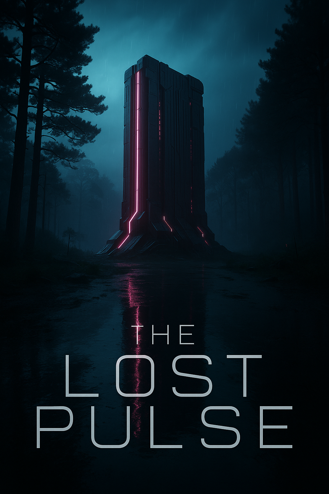
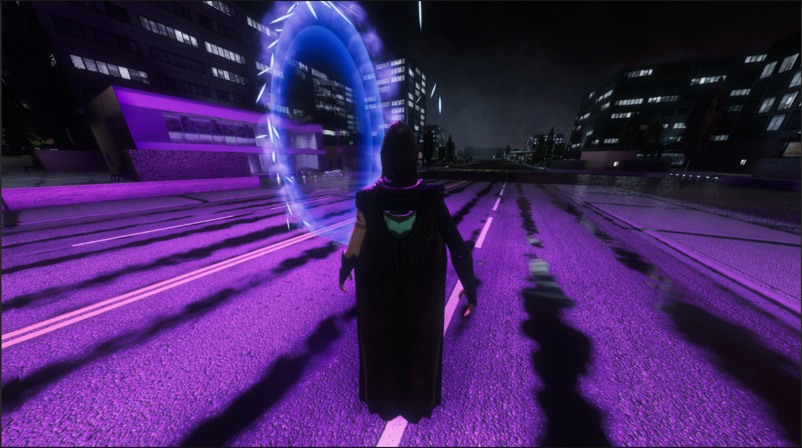
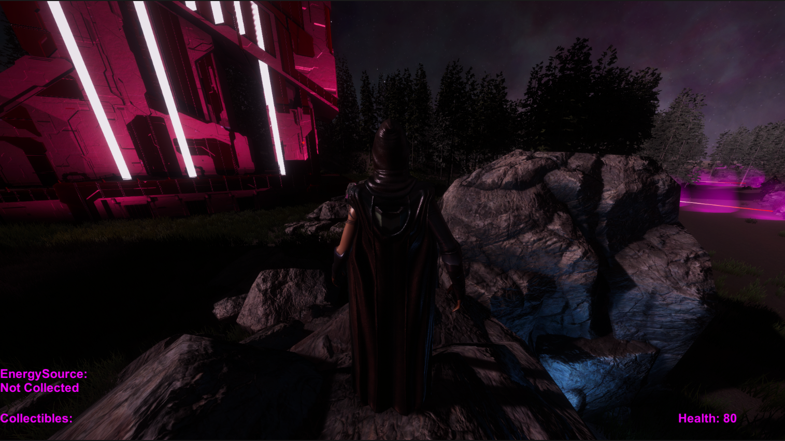
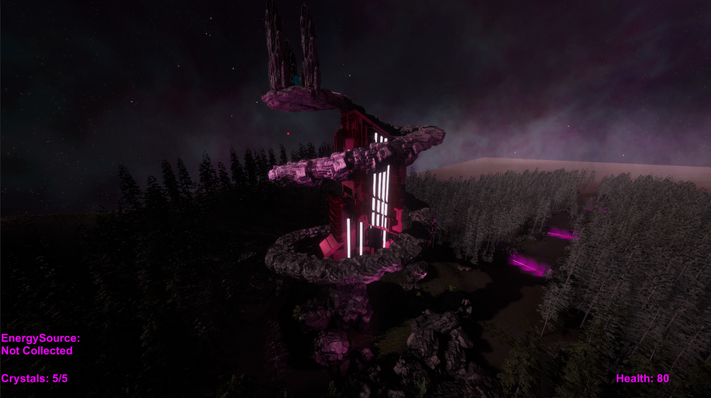
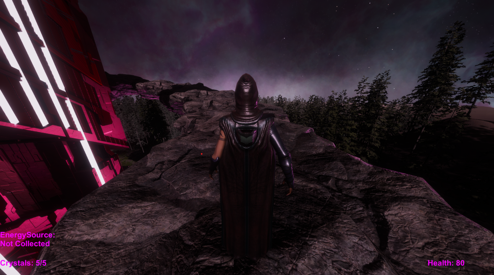
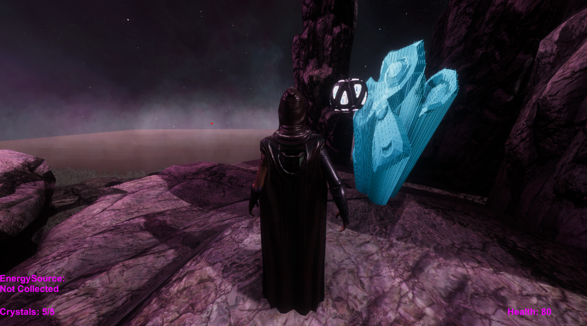
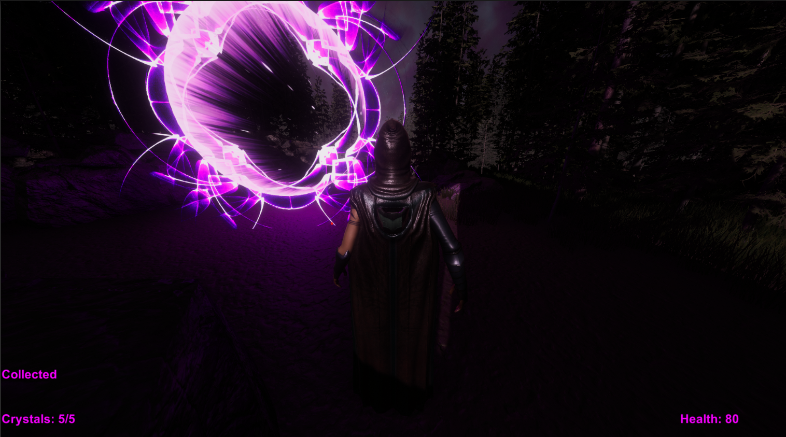
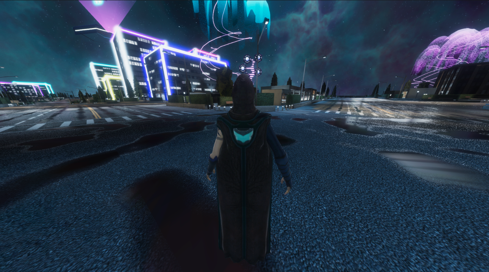

# 🌌 The Lost Pulse

**The Lost Pulse** is an immersive third-person exploration game built in Unity, where the player collects crystals, unlocks ancient mechanisms, and retrieves a powerful energy source to trigger a cinematic sequence and unveil the final mystery.

## 🎮 Screenshots

---

## 🎮 Game Concept

In a futuristic world where energy is scarce, you play as an explorer tasked with retrieving scattered crystals to unlock an ancient energy vault. Along the journey, floating platforms and holograms activate, revealing a hidden energy source. Your objective is to collect all crystals, interact with the world, retrieve the energy core, and experience a final cinematic teleportation sequence.

---

## ✨ Key Features

- 🧊 Crystal collection mechanics with milestone-based triggers  
- ⛰️ Animated rocks/platforms reveal new paths after milestones  
- ⚡ Final energy collectible triggers cinematic camera and platform movement  
- 🎥 Smooth cutscenes using animated cameras and transitions  
- 🌀 Portal system and final teleport with custom animations  
- 🧭 UI feedback for collectible tracking and progression  

---

## 🛠️ Development Process

### 1. Player and Camera System
- Third-person controller setup
- Cinematic camera system using lerp and animation curves

### 2. Collectibles System
- Crystal pickups with UI integration
- Final energy pickup triggers cinematic cutscene and game events

### 3. Platform & World Events
- Platforms/rocks animate into scene after milestones
- Final platform arcs and teleports the player

### 4. Final Cutscene
- Cinematic camera activation
- Platform carries player to a hidden city
- Portal reactivates world energy

---

## 📦 Asset List

- [Nebula Skyboxes](https://assetstore.unity.com/packages/2d/textures-materials/sky/nebula-skyboxes-21992)  
- [ABM Asset Pack](https://assetstore.unity.com/packages/3d/environments/abm-asset-pack-255156)  
- [Translucent Crystals](https://assetstore.unity.com/packages/3d/environments/fantasy/translucent-crystals-106274)  
- [Rolling Balls Sci-Fi Pack](https://assetstore.unity.com/packages/3d/props/rolling-balls-sci-fi-pack-free-297168)  
- [Volumetric Lines](https://assetstore.unity.com/packages/tools/particles-effects/volumetric-lines-29160)  
- [Demo City - Versatile Studio](https://assetstore.unity.com/packages/3d/environments/urban/demo-city-by-versatile-studio-mobile-friendly-269772)  
- [Cyberpunk Shader](https://assetstore.unity.com/packages/vfx/shaders/dynamic-cyberpunk-shader-1-299305)  
- [The Portal Collection](https://assetstore.unity.com/packages/3d/environments/fantasy/the-portal-collection-205438)  
- [Big Poplar Tree (Free)](https://assetstore.unity.com/packages/3d/vegetation/big-poplar-tree-free-301037)  
- [Runes and Portals](https://assetstore.unity.com/packages/3d/environments/fantasy/runesandportals-85098)  
- [Zap VFX](https://assetstore.unity.com/packages/vfx/particles/spells/zap-vfx-303478)  

---

## 🕹️ How to Run the Game

1. **Clone or download** this repository.
2. Open it in **Unity 2022.3 LTS or newer**.
3. Ensure these references are correctly assigned in the Inspector:
   - Player and Camera transforms
   - UI Text (crystal counter, energy core status)
   - Platform & rock animators
   - Final platform target and player final transform
   - CameraSwitcher target
4. Press ▶️ **Play** in the Unity Editor.

---

### 🔧 Controls

| Action       | Key        |
|--------------|------------|
| Move         | W / A / S / D |
| Jump         | Spacebar   |
| Sprint       | Hold Shift |

---

### 🎯 Gameplay Flow

- Collect scattered **crystals** to trigger environmental animations.
- Final crystal unlocks a cinematic **platform cutscene**.
- Retrieve the **energy core** and teleport to a new location.
- Enter the **portal** to reactivate the city and finish the game.

---

## 🏗️ Build Instructions (Optional)

To create a standalone build:
- Go to **File → Build Settings**
- Select **PC, Mac & Linux Standalone**
- Click **Build**

---

Enjoy exploring **The Lost Pulse** 🌌
